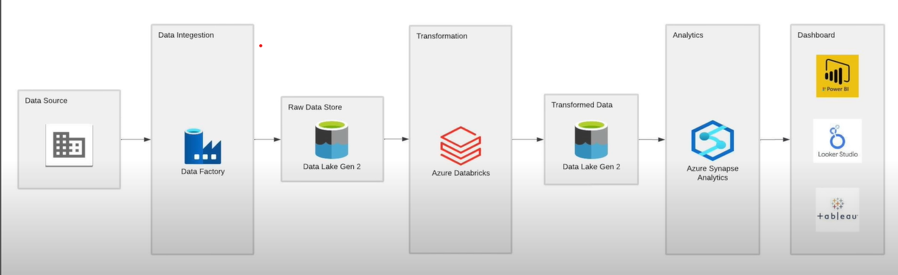

=========================  Olympic-azure-data-engineering-project  =========================
=========================  Author - Dixit Prajapati   =========================

## Project Overview
This project focuses on the analysis of Olympic data using Microsoft Azure services. The goal is to build a data pipeline that ingests, processes, and analyzes data related to the Olympic Games, leveraging tools such as Azure Synapse Analytics, Databricks, and Azure Data Lake Storage (ADLS).

## Objectives
- Ingest raw Olympic data from various sources.
- Store the data securely in Azure Data Lake Storage.
- Transform the data using Apache Spark in Databricks.
- Load the transformed data into Azure Synapse Analytics for further analysis.
- Generate insights and visualizations using Power BI or other BI tools.

## Architecture Diagram

    * Include an architecture diagram to illustrate how the different components of the project (Azure services, data flow, etc.) interact with each other.

## Technologies Used
- **Azure Data Lake Storage (ADLS)**: To store raw and processed data.
- **Azure Synapse Analytics**: For data warehousing and big data analytics.
- **Azure Databricks**: For data transformation and processing using Apache Spark.
- **Apache Spark**: For large-scale data processing.
- **Power BI** (or any other BI tool): For creating reports and dashboards.

## Dataset Description
- **Medals Dataset**: Contains information about medals awarded, including country, athlete, event, and medal type. 
- **Athletes Dataset**: Includes details about athletes who participated in the Tokyo Olympics, such as name, country, and events participated in.
- **Events Dataset**: Provides information on different Olympic events, including event name, category, and venue.
- **Gender Dataset**: Contains data related to the gender of athletes, categorizing them as male, female, or other as per the dataset.
- **Coaches Dataset**: Includes information about the coaches for different sports, such as their names, countries, and the athletes or teams they coached.

## Project Setup
### Prerequisites
- Azure subscription with necessary permissions.
- Databricks workspace set up in Azure.
- Azure Synapse Analytics workspace.

### Steps
1. Clone this repository.
2. Upload the datasets to Azure Data Lake Storage.
3. Configure Databricks to connect to ADLS.
4. Run the notebooks to perform data transformation.
5. Load the processed data into Azure Synapse Analytics.
6. Use Power BI to create visualizations from Synapse Analytics.

## Future Enhancements
- Integrate additional data sources, such as weather data or economic indicators.
- Implement real-time data processing using Azure Stream Analytics.
- Enhance the visualization layer with interactive dashboards.

## Contributing
Contributions are welcome! If you would like to contribute to this project, please open a pull request or raise an issue.

## Contact Information
For any questions or suggestions, please contact:

- **Dixit Prajapati**
- [LinkedIn](https://www.linkedin.com/in/dixit-prajapati) 
- [Portfolio] (https://www.dixitprajapati.com)

